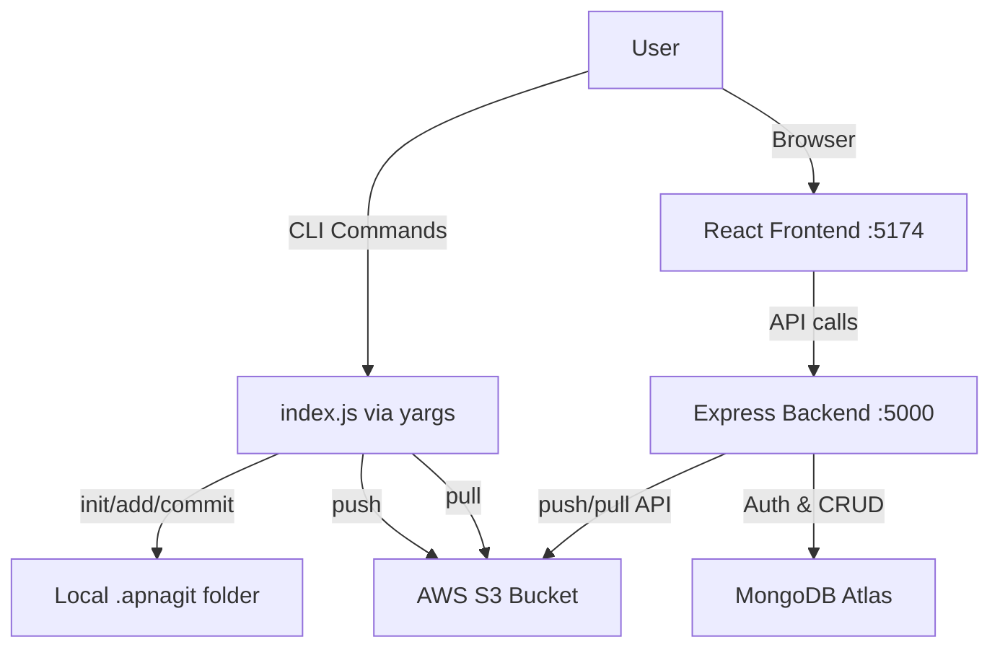
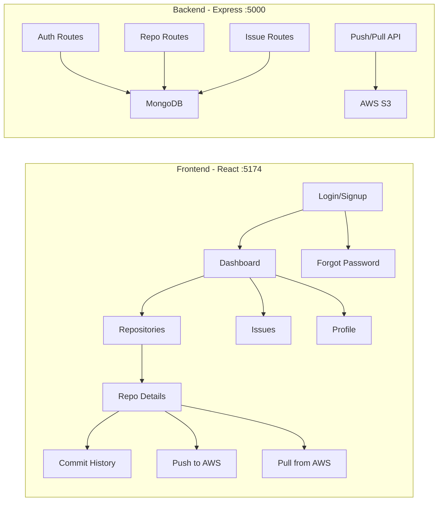

# 🚀 ApnaGit — How Your Version Control System Works

## Overview

ApnaGit is a **custom Git-like version control system** you built from scratch. It has two parts:

| Layer | What it does |
|---|---|
| **CLI (Command Line)** | `init`, `add`, `commit`, `push`, `pull`, `revert` — just like Git commands |
| **Web Dashboard** | React frontend + Express backend for managing repos, users, issues, and more |

The backend (`index.js`) serves **both** — it uses **yargs** to parse CLI commands AND starts an Express web server.

---

## 🏗️ Architecture



---

## 📂 The `.apnagit` Folder Structure

When you run `init`, it creates this structure in your project directory:

```
your-project/
├── .apnagit/                 ← The "repository" (like .git)
│   ├── staging/              ← Files waiting to be committed (like Git's index)
│   │   ├── file1.txt         ← Copies of staged files
│   │   └── file2.txt
│   ├── commit/               ← All committed snapshots
│   │   ├── <uuid-1>/         ← Each commit is a folder with a UUID name
│   │   │   ├── file1.txt     ← Snapshot of file at that point
│   │   │   └── commit.json   ← Metadata: message, timestamp
│   │   └── <uuid-2>/
│   │       ├── file1.txt
│   │       ├── file2.txt
│   │       └── commit.json
│   └── refs/heads/           ← Branch pointers (used by merge)
├── file1.txt                 ← Your actual working files
└── file2.txt
```

---

## 🔧 CLI Commands — Step by Step

### 1️⃣ `node index.js init` — Initialize Repository

```
📁 What happens:
├── Creates .apnagit/ directory
├── Creates .apnagit/commit/ directory  
└── Creates .apnagit/staging/ directory
```

**Code:** [init.js](file:///c:/Users/Sheetal/OneDrive/Desktop/version%20control%20system/backend/controllers/init.js)

```js
// Creates 3 folders: .apnagit, .apnagit/commit, .apnagit/staging
await fs.mkdir(repoPath, { recursive: true });
await fs.mkdir(commitsPath, { recursive: true });
await fs.mkdir(stagingPath, { recursive: true });
```

> **Analogy:** This is like `git init` — it sets up the internal folder structure your VCS needs.

---

### 2️⃣ `node index.js add <file>` — Stage a File

```
📁 What happens:
your-project/file1.txt  ──COPY──▶  .apnagit/staging/file1.txt
```

**Code:** [add.js](file:///c:/Users/Sheetal/OneDrive/Desktop/version%20control%20system/backend/controllers/add.js)

```js
// Copies the file from working directory into the staging area
const filename = path.basename(filePath);
await fs.copyFile(filePath, path.join(stagingPath, filename));
```

> **Analogy:** This is like `git add file1.txt` — it tells ApnaGit "I want to include this file in my next commit."

---

### 3️⃣ `node index.js commit "your message"` — Save a Snapshot

```
📁 What happens:
.apnagit/staging/file1.txt  ──COPY──▶  .apnagit/commit/<new-uuid>/file1.txt
                                        .apnagit/commit/<new-uuid>/commit.json
```

**Code:** [commit.js](file:///c:/Users/Sheetal/OneDrive/Desktop/version%20control%20system/backend/controllers/commit.js)

```js
// 1. Generate a unique ID for this commit
const commitId = uuidv4();  // e.g., "a3f7b2c1-..."

// 2. Create a folder for this commit
await fs.mkdir(commitDir, { recursive: true });

// 3. Copy ALL staged files into the commit folder
for (const file of files) {
    await fs.copyFile(path.join(stagePath, file), path.join(commitDir, file));
}

// 4. Write metadata (message + timestamp)
await fs.writeFile(path.join(commitDir, "commit.json"),
    JSON.stringify({ message, timestamp: new Date().toISOString() }));
```

The `commit.json` looks like:
```json
{
    "message": "Added login feature",
    "timestamp": "2026-04-13T07:30:00.000Z"
}
```

> **Analogy:** This is like `git commit -m "message"` — it takes a permanent snapshot of your staged files.

---

### 4️⃣ `node index.js push` — Upload to AWS S3

```
📁 What happens:
.apnagit/commit/<uuid>/file1.txt  ──UPLOAD──▶  S3: commits/<uuid>/file1.txt
.apnagit/commit/<uuid>/commit.json ──UPLOAD──▶ S3: commits/<uuid>/commit.json
```

**Code:** [push.js](file:///c:/Users/Sheetal/OneDrive/Desktop/version%20control%20system/backend/controllers/push.js)

```js
// Loops through ALL commit folders and uploads every file to S3
for (const commitId of commitDirs) {
    for (const file of files) {
        await s3.upload({
            Bucket: S3_BUCKET,           // "git-demo-bucket12"
            Key: `commits/${commitId}/${file}`,
            Body: fileContent,
        }).promise();
    }
}
```

> **Analogy:** This is like `git push` — it sends your local commits to the cloud (AWS S3 instead of GitHub).

---

### 5️⃣ `node index.js pull` — Download from AWS S3

```
📁 What happens:
S3: commits/<uuid>/file1.txt  ──DOWNLOAD──▶  .apnagit/commit/<uuid>/file1.txt
```

**Code:** [pull.js](file:///c:/Users/Sheetal/OneDrive/Desktop/version%20control%20system/backend/controllers/pull.js)

```js
// Lists all objects in S3 under "commits/" prefix
const data = await s3.listObjectsV2({ Bucket: S3_BUCKET, Prefix: 'commits/' }).promise();

// Downloads each file and writes it locally
for (const obj of data.Contents) {
    const fileContent = await s3.getObject({ Bucket: S3_BUCKET, Key: obj.Key }).promise();
    await fs.promises.writeFile(localPath, fileContent.Body);
}
```

> **Analogy:** This is like `git pull` — it downloads commits from the cloud that you don't have locally.

---

### 6️⃣ `node index.js revert <commitId>` — Restore a Snapshot

```
📁 What happens:
.apnagit/commit/<commitId>/file1.txt  ──COPY──▶  your-project/file1.txt
```

**Code:** [revert.js](file:///c:/Users/Sheetal/OneDrive/Desktop/version%20control%20system/backend/controllers/revert.js)

```js
// Copies all files from the commit folder back to the working directory
for (const file of files) {
    await copyFile(path.join(commitDir, file), path.join(parentDir, file));
}
```

> **Analogy:** This is like `git checkout <commitId>` — it restores your project to exactly how it looked at that commit.

---

## 🌐 Web Dashboard

The web app runs separately and handles **user management, repositories, and collaboration**:



### Key Features:
| Feature | Description |
|---|---|
| **Authentication** | Signup, Login, JWT tokens, Forgot/Reset Password via email |
| **Repositories** | Create, view, star repos — stored in MongoDB |
| **Commit History** | View all commits with messages and timestamps |
| **Push/Pull (Web)** | Push commits to S3 and pull from S3 via UI buttons |
| **Issues** | Create and manage issues on repositories |
| **Merge** | 3-way merge with conflict detection and resolution UI |
| **Profile** | View/edit user profile |

---

## 🔄 Complete Flow — Real Example

```bash
# Step 1: Navigate to backend
cd backend

# Step 2: Initialize a repository
node index.js init
# Output: "Initialized a new empty repository"
# Creates: .apnagit/staging/ and .apnagit/commit/

# Step 3: Create a file to track
echo "Hello World" > hello.txt

# Step 4: Stage the file
node index.js add hello.txt
# Output: "File hello.txt added to staging area."
# Copies hello.txt → .apnagit/staging/hello.txt

# Step 5: Commit the snapshot
node index.js commit "Initial commit"
# Output: "Committed with ID: a3f7b2c1-... created with message: "Initial commit""
# Creates: .apnagit/commit/a3f7b2c1-.../hello.txt + commit.json

# Step 6: Push to cloud
node index.js push
# Output: "⬆️ Uploaded: commits/a3f7b2c1-.../hello.txt"
#         "✅ Push successful: All commits pushed to S3 🚀"

# Step 7: Pull from cloud (e.g., on another machine)
node index.js pull
# Downloads all commits from S3 to local .apnagit/commit/

# Step 8: Revert to a previous commit
node index.js revert a3f7b2c1-...
# Copies all files from that commit back to your working directory
```

---

## 🆚 ApnaGit vs Git — Comparison

| Feature | Git | ApnaGit |
|---|---|---|
| Internal folder | `.git` | `.apnagit` |
| Staging | Index (binary) | `.apnagit/staging/` (copied files) |
| Commits | SHA-1 hash objects | UUID folders with file copies |
| Remote | GitHub/GitLab | AWS S3 bucket |
| Branching | Full branch support | Basic branch + merge |
| Web UI | GitHub.com | Custom React dashboard |
| Auth | SSH keys / tokens | JWT + MongoDB |
| Compression | zlib compressed | Raw file copies |

---

## 📁 Key Files Reference

| File | Purpose |
|---|---|
| [index.js](file:///c:/Users/Sheetal/OneDrive/Desktop/version%20control%20system/backend/index.js) | CLI entry point + Express server setup |
| [init.js](file:///c:/Users/Sheetal/OneDrive/Desktop/version%20control%20system/backend/controllers/init.js) | `init` — creates `.apnagit` structure |
| [add.js](file:///c:/Users/Sheetal/OneDrive/Desktop/version%20control%20system/backend/controllers/add.js) | `add` — copies file to staging |
| [commit.js](file:///c:/Users/Sheetal/OneDrive/Desktop/version%20control%20system/backend/controllers/commit.js) | `commit` — snapshots staging into a UUID folder |
| [push.js](file:///c:/Users/Sheetal/OneDrive/Desktop/version%20control%20system/backend/controllers/push.js) | `push` — uploads commits to AWS S3 |
| [pull.js](file:///c:/Users/Sheetal/OneDrive/Desktop/version%20control%20system/backend/controllers/pull.js) | `pull` — downloads commits from AWS S3 |
| [revert.js](file:///c:/Users/Sheetal/OneDrive/Desktop/version%20control%20system/backend/controllers/revert.js) | `revert` — restores files from a commit |
| [merge.js](file:///c:/Users/Sheetal/OneDrive/Desktop/version%20control%20system/backend/controllers/merge.js) | `merge` — 3-way merge with conflict detection |
| [log.js](file:///c:/Users/Sheetal/OneDrive/Desktop/version%20control%20system/backend/controllers/log.js) | `log` — walks commit chain to show history |
| [aws-config.js](file:///c:/Users/Sheetal/OneDrive/Desktop/version%20control%20system/backend/config/aws-config.js) | AWS S3 connection config |
