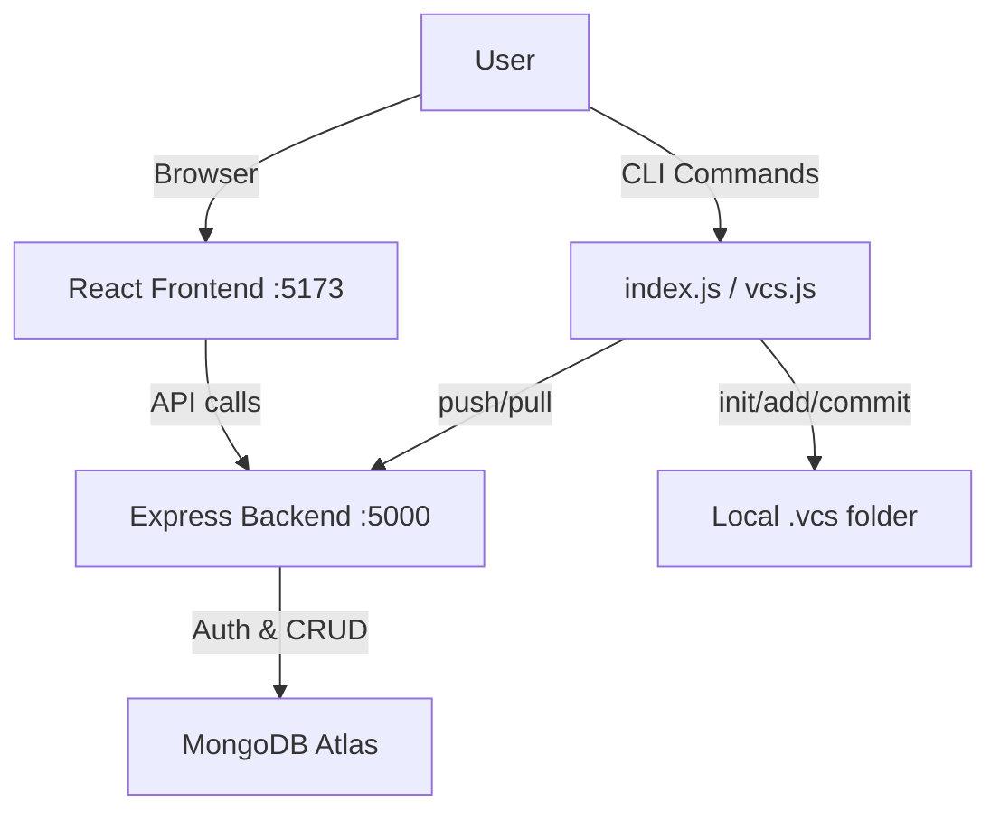

# 🚀 VCS — How Your Version Control System Works

## Overview

VCS is a **custom Git-like version control system** built from scratch. It has two parts:

| Layer | What it does |
|---|---|
| **CLI (Command Line)** | `init`, `add`, `commit`, `push`, `pull`, `revert`, `status`, `log`, `branch`, `merge` |
| **Web Dashboard** | React frontend + Express backend for managing repos, users, issues, and more |

The backend (`index.js`) serves **both** — it uses **yargs** to parse CLI commands AND starts an Express web server.

---

## 🏗️ Architecture



---

## 📂 The `.vcs` Folder Structure

When you run `init`, it creates this structure in your project directory:

```
your-project/
├── .vcs/                     ← The "repository" (like .git)
│   ├── staging/              ← Files waiting to be committed
│   ├── commits/              ← All committed snapshots
│   │   ├── <hash-1>/         ← Each commit is a folder with a SHA-256 hash
│   │   │   ├── files/        ← Actual file snapshots
│   │   │   └── commit.json   ← Metadata: message, timestamp, parent, files
│   ├── branches/             ← Branch pointers (e.g., main.json)
│   ├── HEAD                  ← Current branch name
│   ├── index.json            ← Staging area index (file hashes)
│   └── config.json           ← Repo configuration (name, remote)
├── file1.txt                 ← Your actual working files
└── file2.txt
```

---

## 🔧 CLI Commands — Step by Step

### 1️⃣ `vcs init` — Initialize Repository

```
📁 What happens:
├── Creates .vcs/ directory
├── Creates .vcs/commits/ directory  
├── Creates .vcs/branches/ directory
└── Creates initial HEAD, config.json, and index.json
```

**Code:** [init.js](file:///c:/Users/Sheetal/OneDrive/Desktop/version%20control%20system/backend/controllers/init.js)

---

### 2️⃣ `vcs add <file>` — Stage a File

```
📁 What happens:
├── Calculates SHA-256 hash of the file
├── Copies file to .vcs/staging/
└── Updates .vcs/index.json
```

**Code:** [add.js](file:///c:/Users/Sheetal/OneDrive/Desktop/version%20control%20system/backend/controllers/add.js)

---

### 3️⃣ `vcs commit "message"` — Save a Snapshot

```
📁 What happens:
├── Checks .vcs/index.json for staged files
├── Generates a commit hash from metadata
├── Copies staged files to .vcs/commits/<hash>/files/
├── Writes metadata to .vcs/commits/<hash>/commit.json
└── Updates current branch in .vcs/branches/
```

**Code:** [commit.js](file:///c:/Users/Sheetal/OneDrive/Desktop/version%20control%20system/backend/controllers/commit.js)

---

### 4️⃣ `vcs push` — Sync Commits to Remote

```
📁 What happens:
├── Reads local commits not yet pushed
├── Sends commit data & metadata to Backend API
└── Updates lastPushed in config.json
```

**Code:** [push.js](file:///c:/Users/Sheetal/OneDrive/Desktop/version%20control%20system/backend/controllers/push.js)

---

### 5️⃣ `vcs pull` — Fetch Commits from Remote

```
📁 What happens:
├── Requests all commits for the repo from Backend API
├── Downloads metadata and files (if not already local)
└── Populates .vcs/commits/
```

**Code:** [pull.js](file:///c:/Users/Sheetal/OneDrive/Desktop/version%20control%20system/backend/controllers/pull.js)

---

### 6️⃣ `vcs revert <hash>` — Restore a Snapshot

```
📁 What happens:
├── Copies files from .vcs/commits/<hash>/files/ back to working directory
└── Updates branch head to the reverted commit
```

**Code:** [revert.js](file:///c:/Users/Sheetal/OneDrive/Desktop/version%20control%20system/backend/controllers/revert.js)

---

## 🌐 Web Dashboard

The web app runs separately and handles **user management, repositories, and collaboration**:

### Key Features:
| Feature | Description |
|---|---|
| **Authentication** | Signup, Login, JWT tokens, Forgot/Reset Password |
| **Repositories** | Create, view, star repos — stored in MongoDB |
| **Commit History** | View commit messages, hashes, and files in the browser |
| **Syncing** | Commands like `push` and `pull` synchronize local data with the MongoDB store |
| **Issues** | Create and manage issues on repositories |
| **Merge** | 3-way merge with conflict detection |

---

## 🆚 VCS vs Git — Comparison

| Feature | Git | VCS |
|---|---|---|
| Internal folder | `.git` | `.vcs` |
| Staging | Index (binary) | `.vcs/staging/` + `index.json` |
| Commits | SHA-1 objects | SHA-256 folders with file copies |
| Remote | GitHub/GitLab | Custom Express Backend + MongoDB |
| Branching | Full branch support | Optimized branch storage in JSON |
| Web UI | GitHub.com | Custom React dashboard |

---

## 📁 Key Files Reference

| File | Purpose |
|---|---|
| [vcs.js](file:///c:/Users/Sheetal/OneDrive/Desktop/version%20control%20system/cli/vcs.js) | CLI entry point |
| [vcs.js (Utility)](file:///c:/Users/Sheetal/OneDrive/Desktop/version%20control%20system/backend/utils/vcs.js) | Shared logic (validation, resolveHead) |
| [init.js](file:///c:/Users/Sheetal/OneDrive/Desktop/version%20control%20system/backend/controllers/init.js) | `init` — creates `.vcs` structure |
| [add.js](file:///c:/Users/Sheetal/OneDrive/Desktop/version%20control%20system/backend/controllers/add.js) | `add` — stages files |
| [commit.js](file:///c:/Users/Sheetal/OneDrive/Desktop/version%20control%20system/backend/controllers/commit.js) | `commit` — snapshots staged files |
| [status.js](file:///c:/Users/Sheetal/OneDrive/Desktop/version%20control%20system/backend/controllers/status.js) | `status` — shows changes |
| [log.js](file:///c:/Users/Sheetal/OneDrive/Desktop/version%20control%20system/backend/controllers/log.js) | `log` — shows history |
| [push.js](file:///c:/Users/Sheetal/OneDrive/Desktop/version%20control%20system/backend/controllers/push.js) | `push` — syncs to remote |
| [pull.js](file:///c:/Users/Sheetal/OneDrive/Desktop/version%20control%20system/backend/controllers/pull.js) | `pull` — syncs from remote |
| [merge.js](file:///c:/Users/Sheetal/OneDrive/Desktop/version%20control%20system/backend/controllers/merge.js) | `merge` — merges branches |
